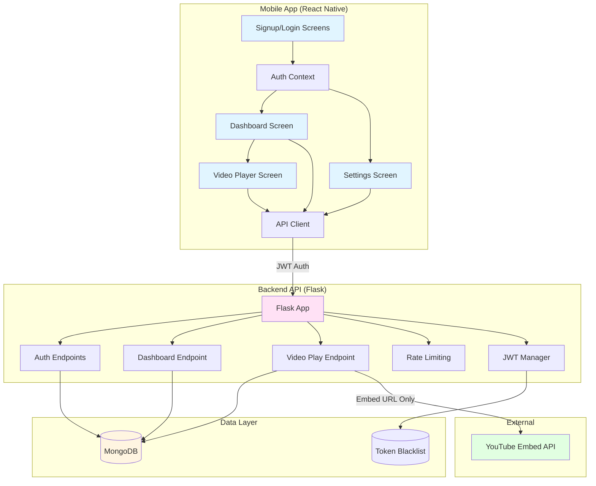

# 🚀 API-First Video App

Full-stack React Native + Flask + MongoDB application following strict API-first architecture.

## 📐 Architecture



## 🏗️ Architecture Principles

### ✅ Critical Rules (Non-Negotiable)

1. **Mobile App = Zero Business Logic**
   - Only API calls, JWT storage, and UI rendering
   - All validation, authentication, and data processing happens in Flask

2. **No YouTube URLs in App**
   - App NEVER receives or stores `youtube.com/watch` URLs
   - Backend proxies and returns embed URLs only: `youtube.com/embed/{id}?enablejsapi=1`

3. **JWT Authentication**
   - Secure password hashing with bcrypt
   - Token-based auth with blacklist support
   - 24-hour token expiry

4. **Backend Standalone**
   - Mobile app is useless without backend
   - All endpoints require authentication (except signup/login)

## 📁 Project Structure

```
API-First-Video-App/
├── backend/
│   ├── app.py                 # Flask application
│   ├── requirements.txt       # Python dependencies
│   ├── .env.example          # Environment template
│   └── README.md             # Backend setup
├── mobile/
│   ├── src/
│   │   ├── api/
│   │   │   └── client.js     # Axios API client with JWT
│   │   ├── context/
│   │   │   └── AuthContext.js # Auth state management
│   │   ├── screens/
│   │   │   ├── LoginScreen.js
│   │   │   ├── SignupScreen.js
│   │   │   ├── DashboardScreen.js
│   │   │   ├── VideoPlayerScreen.js
│   │   │   └── SettingsScreen.js
│   │   ├── navigation/
│   │   │   └── AppNavigator.js
│   │   ├── storage/
│   │   │   └── tokenStorage.js # SecureStore wrapper
│   │   ├── config.js         # API base URL
│   │   └── App.js            # Root component
│   ├── package.json
│   ├── app.json
│   ├── babel.config.js
│   └── index.js
└── README.md                 # This file
```

## 🚀 Quick Start

### Backend Setup

1. **Install MongoDB**
   - Local: Install MongoDB Community Edition
   - Cloud: Create free cluster at [MongoDB Atlas](https://www.mongodb.com/cloud/atlas)

2. **Setup Python Environment**
   ```bash
   cd backend
   python -m venv .venv
   
   # Windows
   .venv\Scripts\activate
   
   # Mac/Linux
   source .venv/bin/activate
   
   pip install -r requirements.txt
   ```

3. **Configure Environment**
   ```bash
   cp .env.example .env
   # Edit .env with your MongoDB URI and JWT secret
   ```

4. **Run Backend**
   ```bash
   python app.py
   ```
   Backend runs on `http://localhost:5000`

5. **Verify Health**
   ```bash
   curl http://localhost:5000/health
   ```

### Mobile App Setup

1. **Install Dependencies**
   ```bash
   cd mobile
   npm install
   ```

2. **Configure API URL**
   - Edit `mobile/src/config.js`
   - For local testing: Use your computer's IP address (not localhost)
   - For deployed backend: Use your Render/Railway URL

3. **Start Expo**
   ```bash
   npm start
   # Scan QR code with Expo Go app
   ```

4. **Build for Production**
   ```bash
   # Install EAS CLI
   npm install -g eas-cli
   
   # Login to Expo
   eas login
   
   # Build
   eas build --profile preview --platform all
   ```

## 📡 API Endpoints

### Authentication

| Method | Endpoint | Auth | Description |
|--------|----------|------|-------------|
| POST | `/auth/signup` | No | Register new user |
| POST | `/auth/login` | No | Login user |
| GET | `/auth/me` | Yes | Get current user info |
| POST | `/auth/logout` | Yes | Logout (blacklist token) |

### Videos

| Method | Endpoint | Auth | Description |
|--------|----------|------|-------------|
| GET | `/dashboard` | Yes | Get exactly 2 active videos |
| GET | `/video/{id}/play` | Yes | Get YouTube embed URL |

### Request/Response Examples

#### Signup
```bash
POST /auth/signup
Content-Type: application/json

{
  "name": "John Doe",
  "email": "john@example.com",
  "password": "password123"
}

Response:
{
  "message": "Success",
  "token": "eyJ0eXAiOiJKV1QiLCJhbGc..."
}
```

#### Login
```bash
POST /auth/login
Content-Type: application/json

{
  "email": "john@example.com",
  "password": "password123"
}

Response:
{
  "message": "Success",
  "token": "eyJ0eXAiOiJKV1QiLCJhbGc..."
}
```

#### Dashboard
```bash
GET /dashboard
Authorization: Bearer {token}

Response:
[
  {
    "id": "507f1f77bcf86cd799439011",
    "title": "How to Start a Startup",
    "description": "Y Combinator's Sam Altman shares practical startup lessons.",
    "thumbnail_url": "https://img.youtube.com/vi/CBYhVcO4WgI/maxresdefault.jpg"
  },
  {
    "id": "507f1f77bcf86cd799439012",
    "title": "Inside the Mind of a Master Procrastinator",
    "description": "A humorous TED talk that explains procrastination behavior.",
    "thumbnail_url": "https://img.youtube.com/vi/arj7oStGLkU/maxresdefault.jpg"
  }
]
```

#### Video Play
```bash
GET /video/{video_id}/play
Authorization: Bearer {token}

Response:
{
  "embed_url": "https://www.youtube.com/embed/CBYhVcO4WgI?enablejsapi=1"
}
```

## 🔒 Security Features

- ✅ Bcrypt password hashing (12 rounds)
- ✅ JWT token authentication
- ✅ Token blacklist on logout
- ✅ Rate limiting (10 requests/hour for auth endpoints)
- ✅ CORS configuration
- ✅ Input validation (email format, password length)
- ✅ Secure token storage (Expo SecureStore)

## 🧪 Testing Checklist

- [ ] App crashes without backend (expected behavior)
- [ ] No YouTube URLs in app bundle/network tab
- [ ] JWT persists across app restarts
- [ ] Video player: play/pause/seek/mute works
- [ ] Dashboard shows exactly 2 videos
- [ ] Invalid login/signup shows errors
- [ ] Logout clears token, navigates to login
- [ ] Backend logs requests
- [ ] Deployed links work

## 🚢 Deployment

**📘 For detailed deployment instructions, see [DEPLOYMENT.md](./DEPLOYMENT.md)**

### Quick Summary

- **Backend**: Deploy separately to Render.com or Railway.app
- **Mobile App**: Build separately using Expo EAS Build
- **Connection**: Update `mobile/src/config.js` with your deployed backend URL

### Backend (Render.com / Railway.app)

1. **Create Account**
   - Sign up at [Render.com](https://render.com) or [Railway.app](https://railway.app)

2. **Connect Repository**
   - Link your GitHub repo
   - Set root directory to `backend/`

3. **Configure Environment**
   - Add environment variables from `.env.example`
   - Set `MONGO_URI` to MongoDB Atlas connection string
   - Set `JWT_SECRET_KEY` to a strong random string
   - Set `CORS_ORIGINS` to your mobile app domain (or `*` for dev)

4. **Deploy**
   - Render: Auto-deploys on push
   - Railway: Click "Deploy"

5. **Update Mobile Config**
   - Update `mobile/src/config.js` with deployed URL

### Mobile (Expo EAS Build)

1. **Install EAS CLI**
   ```bash
   npm install -g eas-cli
   ```

2. **Login**
   ```bash
   eas login
   ```

3. **Configure**
   ```bash
   eas build:configure
   ```

4. **Build**
   ```bash
   eas build --profile preview --platform all
   ```

5. **Share QR Code**
   - EAS provides QR code for testing
   - Or publish to app stores with production profile

## 📚 Dependencies

### Backend
- Flask 2.0+
- Flask-CORS
- Flask-JWT-Extended
- Flask-Limiter
- PyMongo
- bcrypt
- python-dotenv

### Mobile
- Expo SDK 52
- React Navigation v6
- react-native-youtube-iframe
- axios
- expo-secure-store

## 🎯 Features

### Implemented ✅
- User authentication (signup/login/logout)
- JWT token management
- Dashboard with 2 videos
- YouTube video player (embed only)
- Settings screen with user info
- Pull-to-refresh on dashboard
- Secure token storage
- Rate limiting
- Token blacklist

### Bonus Features 🎖️
- Refresh tokens (not implemented)
- Video watch progress tracking (not implemented)
- Infinite scroll dashboard (not implemented)
- Error boundaries (not implemented)
- Dockerized backend (not implemented)
- Video categories filtering (not implemented)

## 📝 Notes

- **Backend URL**: Update `mobile/src/config.js` before running mobile app
- **MongoDB**: Database auto-seeds with 5 sample videos on first run
- **YouTube IDs**: All seed videos use real YouTube video IDs
- **Token Expiry**: Default 24 hours (configurable via env)
- **Rate Limits**: 10 requests/hour for auth, 200/day, 50/hour global

## 🐛 Troubleshooting

### Backend Issues
- **MongoDB Connection**: Check `MONGO_URI` in `.env`
- **Port Already in Use**: Change `PORT` in `.env`
- **Import Errors**: Ensure virtualenv is activated

### Mobile Issues
- **Network Error**: Check `API_BASE_URL` in `config.js`
- **JWT Errors**: Verify backend is running and token is valid
- **YouTube Player Not Loading**: Check embed URL format from backend

## 📄 License

MIT License - Feel free to use for your projects!

## 👤 Author

Built as a production-ready full-stack assignment demonstrating API-first architecture.

---

**⚠️ Important**: This app is intentionally designed to be useless without the backend. This demonstrates proper separation of concerns and API-first design principles.
