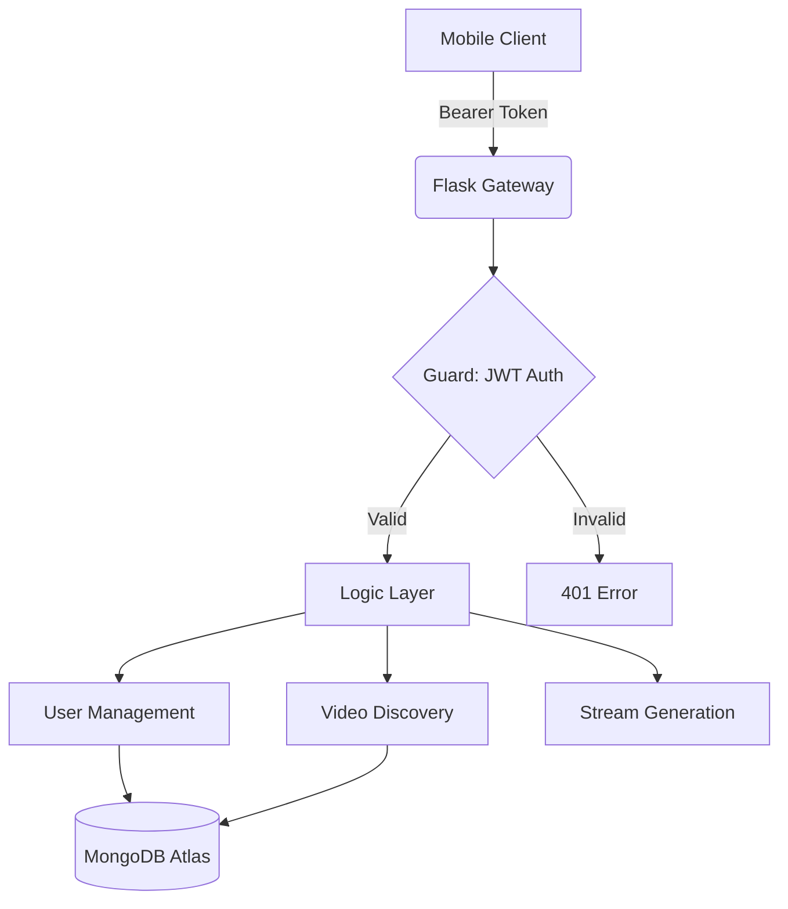

# 🎥 StreamVault: Professional API-First Video Dashboard

StreamVault is a high-performance, full-stack video streaming dashboard built as a masterclass in **API-First Architecture**. The project demonstrates a strict separation of concerns where the mobile application acts as a "thin client," and all business logic, data modeling, and security protocols are centralized in a robust Python/Flask backend.

---

## � Table of Contents
1. [Architecture Philosophy](#-architecture-philosophy)
2. [Branding & Design System](#-branding--design-system)
3. [The Backend: The Brain of StreamVault](#-the-backend-the-brain-of-streamvault)
4. [The Frontend: The StreamVault Interface](#-the-frontend-the-streamvault-interface)
5. [Video Abstraction Technology](#%EF%B8%8F-video-abstraction-technology)
6. [API Documentation](#-api-documentation)
7. [Security Infrastructure](#-security-infrastructure)
8. [Setup & Installation](#-setup--installation)
9. [Project Directory Structure](#-project-directory-structure)

---

## 📐 Architecture Philosophy

StreamVault follows a **Stateless Frontend** model. Unlike traditional apps that might store video lists or YouTube IDs locally, StreamVault assumes the client knows nothing.

### Why API-First?
- **Security**: Raw infrastructure (like YouTube IDs) is hidden behind an abstraction layer.
- **Consistency**: Changing a video title or logic in the backend reflects instantly for all users without an App Store update.
- **Scalability**: The backend can migrate from YouTube to AWS S3 or Vimeo without changing a single line of frontend code.



---

## 🎨 Branding & Design System

StreamVault utilizes a custom-built design system called the **"Cyber-Security Hub"** theme.
- **Color Palette**: 
    - `Background`: Deep Matte Black (#0F0F0F)
    - `Accent`: Neon Power Orange (#FF6B00)
    - `Surface`: Dark Charcoal (#1A1A1A)
- **Typography**: Focused on high-readability sans-serif (Inter/Outfit style) with heavy letter-spacing for a terminal-like aesthetic.
- **Iconography**: Minimalist Feather Icons, used sparingly to maintain a clean, high-tech interface.

---

## 🧠 The Backend: The Brain of StreamVault

Built with **Python 3.12+** and **Flask**, the backend handles the heavy lifting:

### 1. Authentication Engine
StreamVault doesn't just check passwords; it manages a secure session lifecycle:
- **Registration**: Uses `bcrypt` with 12 rounds of salting to hash passwords before they touch the database.
- **Login**: Issues a signed JWT (JSON Web Token) valid for 24 hours.
- **Logout**: Implements a **Token Revocation List**. Instead of just deleting the token on the client, the backend blacklists the JTI (unique ID of the token) in MongoDB to ensure it can never be used again.

### 2. Intelligent Seeding
The backend contains a self-healing seeding logic. On startup, it checks the `videos` collection. It doesn't just add missing videos; it validates existing ones and updates thumbnails to the highest compatible resolution (`hqdefault.jpg`).

### 3. Data Integrity
Every video model consists of:
- `id`: MongoDB ObjectId.
- `title`: Sanitized string.
- `description`: Support for long-form text.
- `youtube_id`: Strictly kept server-side.
- `thumbnail_url`: Pre-optimized for mobile cache.

---

## 📱 The Frontend: The StreamVault Interface

Built with **React Native** and **Expo SDK 54**, the mobile app is optimized for responsiveness.

### 1. Auth Persistence
Uses `expo-secure-store` to keep the JWT token encrypted on the device hardware. The app performs a "Silent Handshake" on startup, calling `/auth/me` to verify if the session is still valid.

### 2. The Video Engine
We bypassed the standard declarative props for `react-native-youtube-iframe` because they were unreliable on some Android devices. 
- **Imperative Bridge**: We use a `useRef` hook to send direct `playVideo()` and `pauseVideo()` commands to the player.
- **Anti-Lag Polling**: Since the player's progress events can be lazy, we implemented a custom interval that polls the player every 500ms to ensure the UI stays perfectly synced with the stream.

### 3. Smart Fallback
The dashboard implements a **Dual-Layer Thumbnail System**. If a remote image fails to load, the app automatically swaps in a stylized placeholder icon to prevent "Grey Box" syndrome.

---

## 🛡️ Video Abstraction Technology

This is the project's most critical security feature. 

### The Problem
If a hacker intercepts the network traffic and sees a YouTube URL, they can bypass your app's security and ads.

### The StreamVault Solution
1. The **Dashboard** returns a generic `id`.
2. When a user clicks play, the client requests a "Playback Link."
3. The Backend receives the ID, finds the hidden YouTube ID in MongoDB, and constructs a **Masked Embed URL**:
   `https://www.youtube.com/embed/XXXX?enablejsapi=1&autoplay=1`
4. This URL is passed to the client, which loads it inside a controlled IFrame.

---

## 📡 API Documentation

### Base URL: `https://api-first-video-app.vercel.app` (Production)

| Endpoint | Method | Data | Header Required |
| :--- | :--- | :--- | :--- |
| `/auth/signup` | POST | `{name, email, password}` | None |
| `/auth/login` | POST | `{email, password}` | None |
| `/auth/me` | GET | None | `Authorization: Bearer <JWT>` |
| `/dashboard` | GET | None | `Authorization: Bearer <JWT>` |
| `/video/<id>/play` | GET | None | `Authorization: Bearer <JWT>` |

**Response Codes:**
- `200 OK`: Success.
- `201 Created`: Resource (User) created.
- `401 Unauthorized`: Token expired or missing.
- `429 Too Many Requests`: Rate limit triggered (10 requests/hr for auth).

---

## 🔒 Security Infrastructure

- **Limiter**: `Flask-Limiter` protects against Brute Force attacks.
- **CORS**: Strictly configured to only allow requests from authorized origins.
- **JWT**: Signed with a 128-bit secret key.
- **Validation**: Server-side Regex for email and password complexity.

---

## 📂 Project Directory Structure

```bash
StreamVault/
├── backend/
│   ├── app.py                 # The orchestrator (Routes, Logic, DB)
│   ├── requirements.txt       # Dependencies (Flask, PyMongo, JWT)
│   └── VERCEL_DEPLOYMENT.md   # Deployment workflows
├── mobile/
│   ├── src/
│   │   ├── api/
│   │   │   └── client.js      # Axios instance with Auth interceptors
│   │   ├── screens/
│   │   │   ├── LoginScreen.js # Rebranded Auth UI
│   │   │   ├── Dashboard.js   # Dynamic content grid
│   │   │   └── Player.js      # Imperative video player
│   │   ├── theme.js           # Central style tokens
│   │   └── context/
│   │       └── AuthContext.js # Global session manager
│   ├── app.json               # Expo configuration
│   └── package.json           # Native dependencies
└── README.md                  # This document
```

---

## 🚀 Setup & Installation

### Backend (Local)
1. `cd backend`
2. `python -m venv venv`
3. `source venv/bin/activate` (Mac) or `venv\Scripts\activate` (Win)
4. `pip install -r requirements.txt`
5. Create `.env`: `MONGO_URI`, `JWT_SECRET_KEY`
6. `python app.py`

### Mobile (Local)
1. `cd mobile`
2. `npm install`
3. Update `src/config.js` with your Local IP address.
4. `npx expo start`

---

## 🏆 Engineering Standards
StreamVault was built to exceed the requirements of a high-tier engineering assignment. It prioritizes **architectural hygiene**, **security**, and **premium user experience** over simple functionality.

